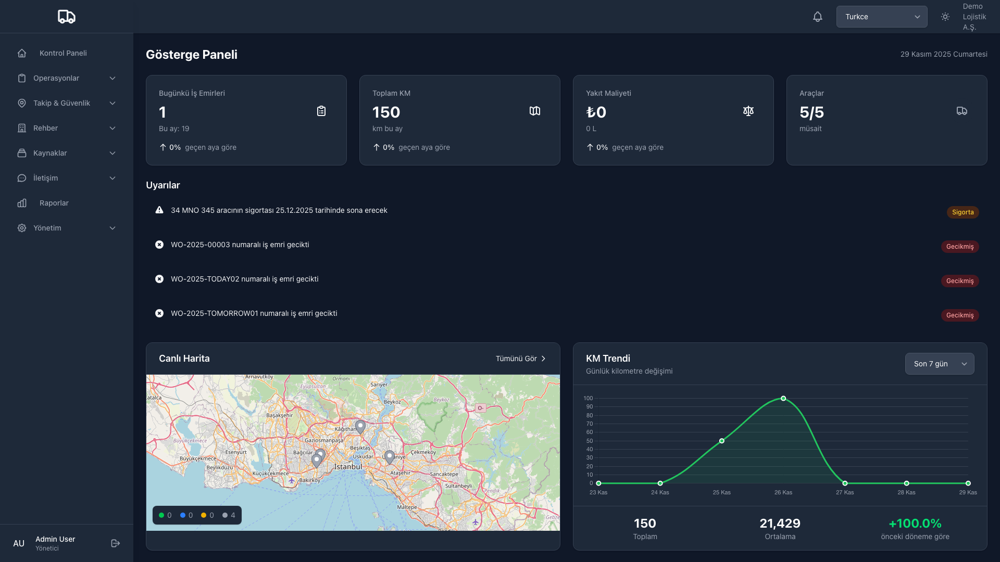
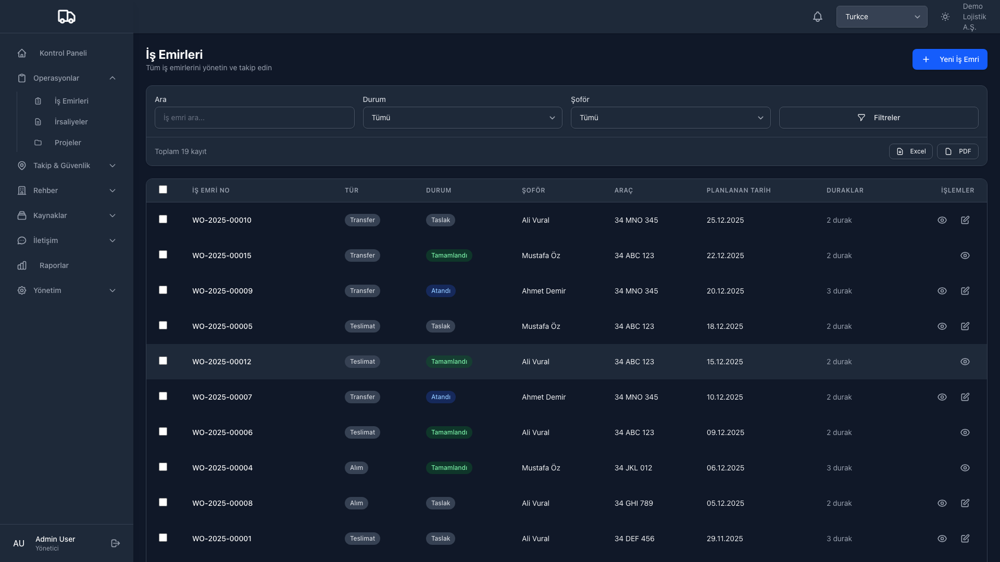
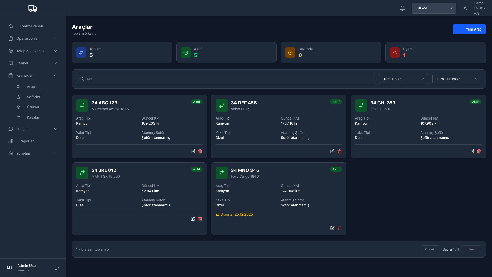
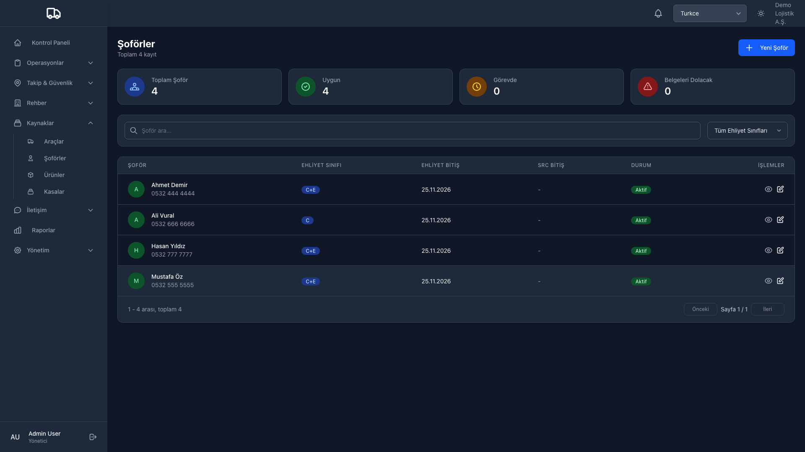
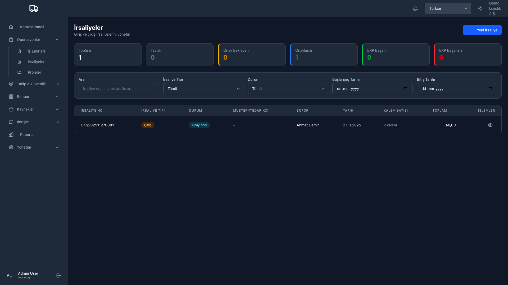
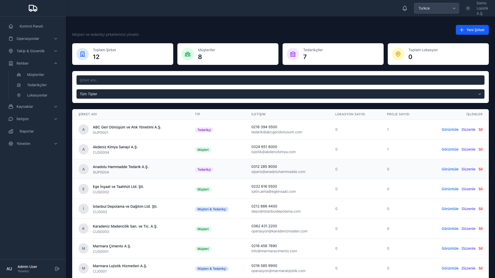
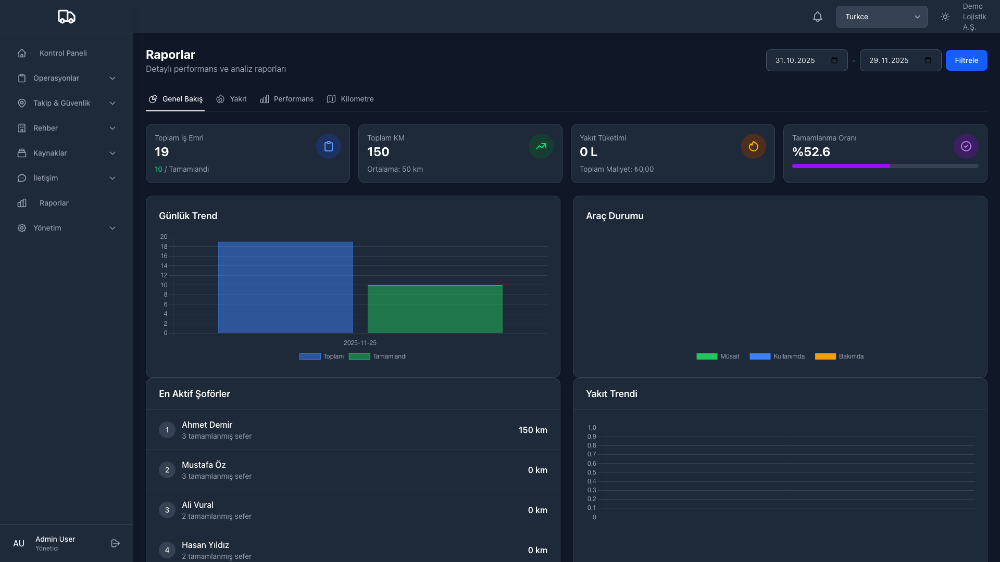
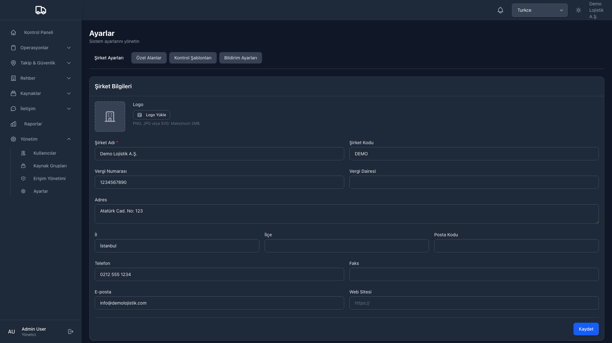

# LoadSmart - Filo Yonetim Sistemi

**Canli takip, is emri yonetimi ve mobil sofor uygulamasi iceren kapsamli filo yonetim ve lojistik platformu.**

[English Documentation](README.md)

---

## Ekran Goruntuleri

Ekran goruntuleri icin tiklayin

### Kontrol Paneli

### Is Emirleri

### Arac Yonetimi

### Sofor Yonetimi

### Irsaliyeler

### Musteri Yonetimi

### Raporlar

### Ayarlar

---

## Genel Bakis

LoadSmart, lojistik sirketleri icin tasarlanmis tam ozellikli bir filo yonetim sistemidir. Gercek zamanli GPS takibi, akilli is emri yonetimi, sofor mobil uygulamalari ve kapsamli raporlama ile filo operasyonlariniz uzerinde tam kontrol saglar.

## Temel Ozellikler

### Filo Yonetimi
- **Arac Yonetimi** - Bakim takibi, sigorta ve belge yonetimi ile tam arac kaydi
- **Sofor Yonetimi** - Sofor profilleri, ehliyet takibi, performans metrikleri ve atama gecmisi
- **Dorse/Konteyner Takibi** - Durum izleme ile dorse ve konteyner varlik yonetimi

### Is Emri Sistemi
- **Akilli Is Emirleri** - Surukle-birak siralama ile coklu durakli rota planlama
- **Durak Turleri** - Mal Alma, Teslimat, Yukleme, Bosaltma, Gumruk, Tartim, Yakit, Mola duraklari
- **Urun Yonetimi** - Her durak icin planlanan ve gerceklesen miktarlari takip edin
- **Dijital Imza** - Teslimat belgesi (POD) icin imza yakalama
- **Fotograf Dokumantasyonu** - Dokumantasyon icin duraklara fotograf ekleme

### Gercek Zamanli Takip
- **Canli GPS Takibi** - Interaktif haritalar uzerinde gercek zamanli arac konumu
- **Rota Gorsellestirme** - Zaman damgasi ve hiz verileriyle tamamlanan rotalari goruntuleme
- **Cit Alani** - Konum tabanli uyarilar ve bildirimler
- **Arac Gecmisi** - Arac hareketlerinin tarihsel oynatimi

### Mobil Uygulama (Android/iOS)
- **Sofor Uygulamasi** - Soforler icin tam ozellikli mobil uygulama
- **Cevrimdisi Destek** - Internet baglantisi olmadan calisma
- **Barkod Tarama** - Urun ve belge tarama
- **Navigasyon Entegrasyonu** - Entegre haritalar ve yonlendirme
- **Push Bildirimleri** - Gercek zamanli guncellemeler ve uyarilar
- **Sesli Komutlar** - Eller serbest kullanim destegi

### Irsaliye ve Belge Yonetimi
- **Dijital Irsaliyeler** - Elektronik irsaliye olusturma ve yonetimi
- **PDF Disa Aktarma** - Profesyonel irsaliye belgeleri olusturma
- **E-posta Entegrasyonu** - Musterilere POD belgeleri gonderme
- **Belge Ekleri** - Is emirlerine herhangi bir belge ekleme

### Raporlama ve Analitik
- **Dashboard** - Gercek zamanli KPI'lar ve filo genel gorunumu
- **Ozel Raporlar** - Herhangi bir tarih araligi icin rapor olusturma
- **Excel Disa Aktarma** - Harici analiz icin veri disa aktarma
- **Performans Metrikleri** - Sofor ve arac performans takibi

### Iletisim
- **Mesajlasma Merkezi** - Yonetici ve soforler arasinda gercek zamanli sohbet
- **Push Bildirimleri** - Onemli olaylar icin anlik uyarilar
- **SOS Uyarilari** - Soforler icin acil durum uyari sistemi
- **Bildirim Yonetimi** - Ozellestirilebilir bildirim tercihleri

### Arac Kontrolleri
- **Arac Kontrolleri** - Yolculuk oncesi ve sonrasi kontrol listeleri
- **Ozel Sablonlar** - Farkli arac turleri icin kontrol sablonlari olusturma
- **Fotograf Kaniti** - Kontrol ogelerine fotograf ekleme
- **Uyumluluk Takibi** - Kontrol tamamlanma oranlarini takip etme

### Guvenlik ve Erisim Kontrolu
- **Rol Tabanli Erisim** - Yonetici, sevkiyatci, sofor rolleri
- **Kaynak Gruplari** - Takim veya bolgelere gore erisim duzenleme
- **Denetim Gunlugu** - Tam aktivite gecmisi
- **Guvenli Kimlik Dogrulama** - JWT tabanli API kimlik dogrulamasi

---

## Demo

**Canli demo ile ilgileniyor musunuz?** LoadSmart'in tum yeteneklerini gormek icin benimle iletisime gecin.

---

## Iletisim

**Tolga Tasci**
- GitHub: [@tolgatasci](https://github.com/tolgatasci)
- Website: [loadsmart.app](https://loadsmart.app)

---

**Tolga Tasci tarafindan tutku ile yapildi**

